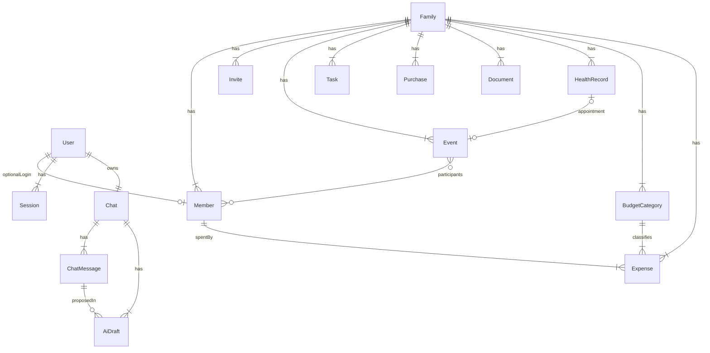

# Модель данных

Схема: [schema.prisma](schema.prisma). Здесь — правила, которых нет в SQL: повторы, маски, каскады, выборка в AI, синк приёма с календарём.

Имена в БД и API — английские. Продуктовые термины — из [README.md](../README.md).

## Связи

- **User** — логин (email + пароль). Пока User жив, `email` уникален глобально: второе приглашение — отказ (до фазы 3). После удаления аккаунта email свободен.
- **Member** — карточка. `userId` nullable: малыш в данных есть, входа и чата нет.
- **Chat** — один на аккаунт (`ownerUserId` unique), создаётся вместе с User. В `ChatMessage` только `USER` и `ASSISTANT`; system-промпт на каждый вызов, в БД не пишется.

## Вход и приглашения

- Создатель семьи: email + пароль + чекбокс 18+ (`declaredAdultAt`) + **имя и дата рождения** своей карточки + пояс семьи. Создаются User, Family, Member (`ADULT`), Chat, Session.
- Email хранится в нижнем регистре, уникален глобально, пока User существует. Пароль: 8–72 символа, в БД argon2id. Несколько сессий на User (телефон + ноут) допустимы; logout удаляет только текущую; удаление аккаунта — все.
- Приглашение: одноразовый токен (в БД только `tokenHash`), TTL 48 часов, роль, опционально `memberId`. Ссылка `/invite/:token` показывается взрослому, он передаёт её сам. Превью по токену для гостя — роль, имя карточки (`memberName: null`, если карточка новая), срок; без состава семьи. Если задан `memberId`, `role` приглашения должен совпасть с ролью карточки, иначе `validation`.
- Accept: email + пароль. Если роль `ADULT` — обязателен чекбокс 18+. Если `memberId` задан — аккаунт клеится к карточке (она без `userId`); имя/дата уже на карточке. Если нет — создаётся новая карточка, нужны `name` и `birthDate`. Уже занятый email — `conflict`.
- Нельзя снять роль / удалить последнего взрослого. `ADULT` → `CHILD` допустимо, если остаётся хотя бы один взрослый.
- **Удаление аккаунта** (`DELETE /auth/account`): все сессии и чат User стираются, `Member.userId` = null, карточка остаётся. Email после этого свободен. Повторная регистрация создаёт **новую** семью (это не фаза 3: старого User нет). Вернуться в старую семью — только новым приглашением на эту карточку или новую. Последний взрослый так уйти не может — только удаление семьи.
- **Удаление карточки** (`DELETE /members/:id`): карточка и связанные дела/документы/здоровье. Если был аккаунт — User тоже удаляется (не оставляем «человека без семьи»).

Токен приглашения — 32 случайных байта, в URL plaintext один раз, в БД hash.

## Время

В БД — `timestamptz`. Показ — `Family.timezone` (IANA), не пояс устройства. Конвертации между поясами нет: пояс один на семью.

Событие на весь день: `allDay = true`, `startsAt` = полночь этой даты в поясе семьи, сохранённая как timestamptz. `endsAt` необязателен.

`PATCH /family` `{ timezone }` не переписывает уже сохранённые `timestamptz`. All-day события могут съехать на соседнюю календарную дату — в MVP допустимо.

## Повторы событий

Вхождения серии **считаются на чтении**, в таблице одна строка на серию. Исключений («пропустить это занятие») в MVP нет.

- `recurrence`: `NONE` | `WEEKLY` | `YEARLY`. Клиент `seriesId` не шлёт. Сервер в одном insert задаёт `id` и `seriesId = id`.
- `detachedFromSeriesId` — UUID без FK, заполняется при split «только это».
- `recurrenceUntil` — необязательный конец серии.
- `participantIds` — минимум 1, иначе `validation`.
- `occurrenceEnd`: если у серии есть `endsAt`, то `occurrenceStart + (endsAt - startsAt)`, иначе `null`.
- День рождения — отдельное ежегодное событие, не создаётся из `birthDate`.

Правка и удаление:

| Действие | `scope=series` | `scope=this` |
| --- | --- | --- |
| PATCH | Меняется строка серии | Split: копия без повтора на эту дату + серия сдвигается, чтобы дату не дублировать |
| DELETE | Удаляется серия | **Запрещено** — это и есть исключение вхождения |

Клиент идентифицирует вхождение полем `occurrenceStart` (то же значение, что в списке событий).

Split при PATCH `scope=this` для вхождения на дату D:

1. Новое событие на D: `recurrence = NONE`, `detachedFromSeriesId = seriesId`, новые поля.
2. Хвост серии после D: либо сдвигается `startsAt` / `recurrenceUntil` у исходной строки, либо создаётся новая серия с новым `seriesId` начиная с D + период.
3. Отвязанные копии предыдущих правок «только это» не трогаются.

Событие `HEALTH_APPOINTMENT` из календаря не PATCH/DELETE: источник — мед. запись. Удаляется только каскадом вместе с `HealthRecord`.

Тип `DOCTOR` — обычное событие, не мед. карта. В интерфейсе подписано. AI про приёмы читает только `HealthRecord` с `kind = APPOINTMENT`.

## Повторы дел

Клиент `seriesId` не шлёт. Сервер в одном insert задаёт `id` и `seriesId = id`.

Отметка «сделано» у повтора:

1. Текущая строка: `status = DONE`, `completedAt = now()`.
2. Новая строка: `OPEN`, тот же `seriesId` / title / assignee / recurrence, `dueAt = исходный dueAt + период` (день или неделя), даже если закрыли позже.

Снять «сделано» может только взрослый (`POST .../reopen`): `DONE` → `OPEN`, `completedAt` сбрасывается. Для повтора reopen не удаляет уже созданное следующее вхождение.

## Покупки

Один список на семью. `quantity` без единиц измерения. `category` при создании необязателен, по умолчанию `OTHER`.

Ребёнок:

- `isBought: true` — на **любую** позицию;
- title / category / quantity — только свою (`addedByMemberId` = его Member) и пока `isBought = false`;
- `isBought: false` поставить нельзя;
- чужое не удаляет.

Взрослый — полный PATCH, в том числе снять «куплено». Очистка купленного — только взрослый.

## Документы и маскирование

Номер в БД хранится полностью в `Document.number`.

Маска `••••1234` (последние 4 символа; если номер короче 4 — все символы маскируются) применяется:

- списки `GET /documents`;
- ответы AI и промпт модели (в модель номер **не передаётся**: тип, владелец, дата окончания, статус «скоро истекает»);
- логи промптов, Prisma query log, ошибки клиента, `AuditLog.metadata`.

Нет номера → `numberMasked: null`. Полный номер — только `GET /documents/:id` взрослому. Ребёнок свои документы читает с маской. Статус «скоро истекает» — `expiresAt` в пределах 30 дней от сегодня в поясе семьи.

## Здоровье и календарь

Аллергии живут в `Member.allergies`, в здоровье не дублируются.

Поля `HealthRecord` типизированы по `kind` (не JSON). Неиспользуемые для вида колонки — null. Обязательные: врач — имя и специальность; прививка — название и дата; осмотр — тип и дата; приём — название и дата/время.

Приём (`APPOINTMENT`) создаётся в одной транзакции с событием:

- `Event.type = HEALTH_APPOINTMENT`
- `Event.healthRecordId` → запись
- `Event.startsAt` / title копируются из `appointmentAt` / `appointmentTitle`
- участник события = `HealthRecord.memberId`
- `recurrence = NONE`, в календаре только чтение

Правка или удаление приёма обновляет или снимает событие. Обратного синка нет. Событие `HEALTH_APPOINTMENT` из календаря не удаляют отдельно.

## Чат и черновики AI

Чат есть только у Member с `userId`. Чаты взрослых друг другу не видны. Чаты детей семьи видны взрослым этой семьи. Писать сообщения и применять черновики можно только в **свой** чат.

Черновик — одна операция. Составной запрос («молоко и хлеб») → несколько строк `AiDraft` с одним `messageId` (assistant-сообщение). TTL **1 час**, затем `EXPIRED`. Применить / отклонить — только кнопкой по id из того же чата. Текст «да» черновик не применяет.

Apply по роли (те же права, что у соответствующего POST/PATCH):

- `CREATE_PURCHASE`, `MARK_PURCHASE_BOUGHT` — оба (ребёнок — по правилам покупок выше)
- `CREATE_EVENT`, `CREATE_TASK`, `CREATE_EXPENSE` — только взрослый; ребёнок — `forbidden`
- `COMPLETE_TASK` — ребёнок только своё дело

Операции по подфазам:

- 1.3: `CREATE_PURCHASE`
- 1.4: `CREATE_EVENT`, `CREATE_TASK`, `COMPLETE_TASK`, `MARK_PURCHASE_BOUGHT`
- 2: `CREATE_EXPENSE`
- Документы и мед. записи из чата не создаются

Сопоставление по имени: 0 совпадений — сказать; больше одного — уточнить списком карточек (`id` + имя); без догадок.

Выборка в модель — на сервере по роли, не «вся БД» и не с клиента. Контракт вызова и tools — [ai.md](ai.md). Если LLM недоступна — шаблон, без записи в данные.

## Бюджет

Журнал расходов на семью. Валюта — рубли, поля валюты нет. Доходов и лимитов нет.

- `BudgetCategory.name` уникален в семье без учёта регистра (проверка в коде). Стартовый набор при создании семьи: Продукты, Быт, Аптека, Транспорт, Другое.
- Удаление категории с расходами — `conflict`.
- `Expense.spentAt` — календарный день в поясе семьи (`date`). `amount` — `Decimal(12, 2)`, в API число.
- `importFingerprint` — sha256(`дата операции|сумма платежа|описание|карта`) у расходов из CSV Т-Банка; у ручных пусто. Уникален в семье, повторная загрузка той же строки пропускается.
- Импорт: только завершённый статус (`OK` / `Ок`), отрицательная сумма, валюта RUB. Понимает и старый CSV («Сумма платежа», «Категория»), и текущий экспорт операций («Сумма операции», «Категория по-умолчанию»). Категория банка мапится на семейную (Супермаркеты/Фастфуд/Рестораны → Продукты, Аптеки → Аптека, Транспорт/Такси/АЗС/Ж/д/Авиабилеты → Транспорт, ЖКХ/Связь/Дом и ремонт/Канцтовары/Животные/Маркетплейсы → Быт), иначе одноимённая или «Другое». CSV на диск не пишется.
- `spentByMemberId` — любая карточка семьи. Сводка «кто сколько» — сумма `amount` по члену за выбранный месяц. Импорт ставит загрузившего взрослого.
- Ребёнок модуль не видит: все эндпоинты `requireAdult`, в Facts и tools бюджета нет.

## Напоминания

Отдельной таблицы нет, считаются на чтении.

- События с `remindInUi`: «сегодня» и «скоро» = сегодня … +7 дней в поясе семьи. `HEALTH_APPOINTMENT` в эти списки не входит.
- Здоровье: приёмы (`appointmentAt`), прививки (`vaccinatedAt`) и осмотры (`checkupAt`) на сегодня … +7 дней. Врач без даты не попадает. Ребёнок — только свои.
- Документы: «скоро истекает» за 30 дней (подфаза 1.4).
- Канал — только индикатор в UI.

## Окно календаря у ребёнка

Список `GET /events`: события, где ребёнок **участник**, с датой вхождения от сегодня до сегодня + 30 дней (с учётом повторов). Фильтр `memberId` чужого человека — `forbidden`; в UI фильтра по членам у ребёнка нет.

`GET /events/:id`: если ребёнок участник — отдать, даже вне окна 30 дней. Списки чужого (документы, здоровье, чаты взрослых) — пустые. Запрос конкретной чужой сущности семьи — `403`, несуществующий id — `404`.

## Каскады

Удаление семьи (после `confirm` + списка того, что сотрётся) — hard cascade всех строк с `familyId`: члены, приглашения, события, дела, покупки, документы, здоровье, категории бюджета, расходы, чаты, сообщения, черновики, аудит.

Удаление Member: участники событий, документы и здоровье карточки, назначенные дела, расходы этого человека (`spentBy`); если был аккаунт — User (сессии, чат). `Purchase.addedByMemberId`, `Event.createdByMemberId` и `Expense.createdByMemberId` — SetNull. Нельзя удалить последнего взрослого.

`AuditLog` пишется до подфазы 1.5: просмотр полного номера, чтение здоровья, смена роли, приглашения, удаление семьи/аккаунта. В metadata нет полного номера и тел промптов. Перед `ACCOUNT_DELETE` / `FAMILY_DELETE` в metadata пишутся `actorEmail` и `actorMemberId`: после cascade `userId` станет null, кто сделал — только из metadata.
